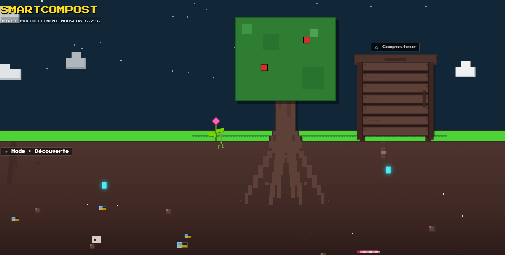
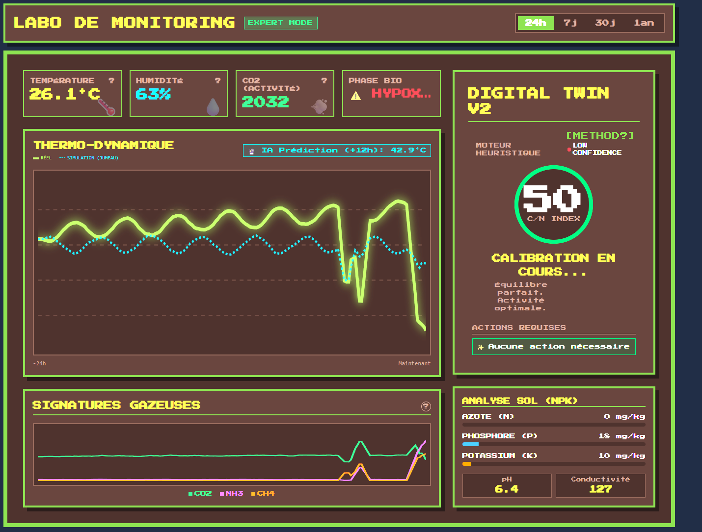
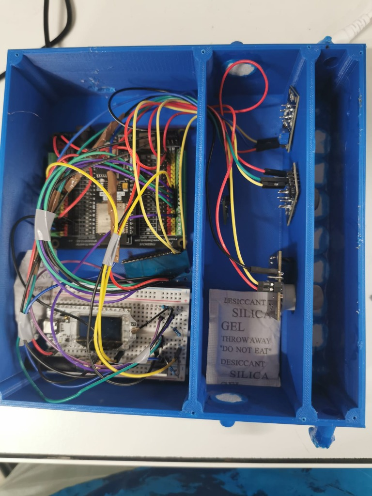
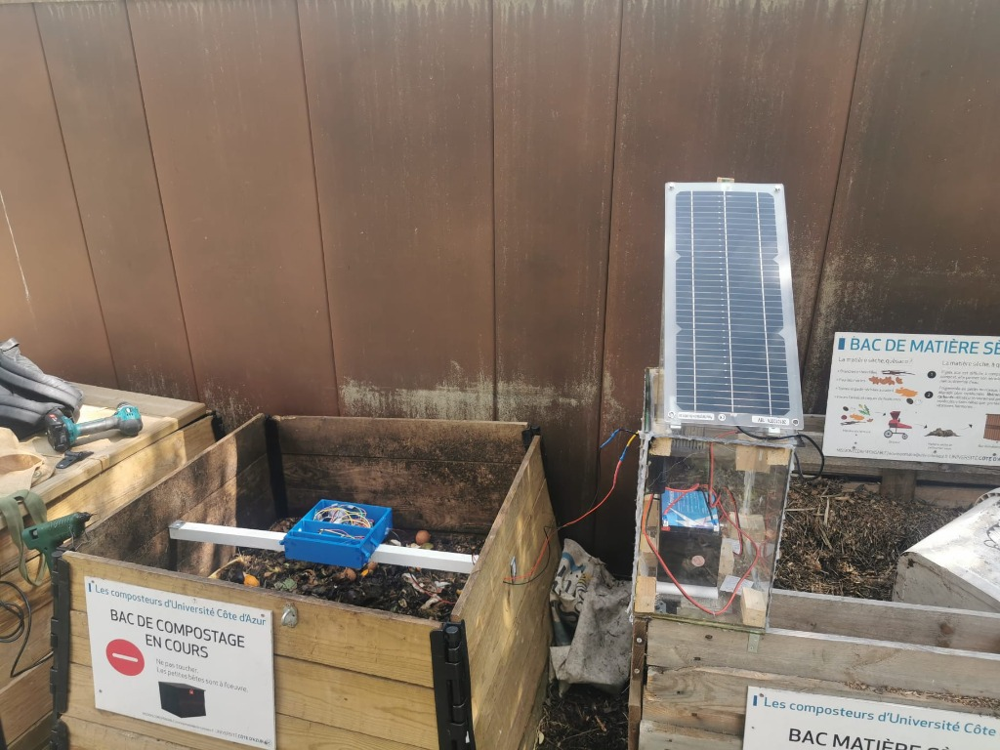

# 🌱 SmartCompost

**Un écosystème connecté pour visualiser la vie invisible du sol.**

🚧 État du Projet & Avertissements (Alpha)
Ce projet est un prototype fonctionnel en cours d'amélioration. Il fait suite à une V1 déjà déployée et propose une V2 plus complète (meilleur boîtier, nouveaux capteurs, gestion d'énergie optimisée).

⚠️ Note de transparence :

Calculs Théoriques : Les algorithmes (notamment le rapport C/N et les flux de gaz) sont actuellement des ébauches théoriques. Ils ont été testés sur le court terme, mais leur fiabilité sur une rotation complète de compost reste à démontrer.

Calibrations en suspens : Les vérifications mathématiques approfondies et les calibrations physiques (notamment pour les capteurs de gaz MQ) n'ont pas encore été finalisées.

Assistance IA : L'IA a été utilisée pour m'aider à générer le code et la documentation technique. En raison de contraintes de temps, l'intégralité des documents n'a pas encore pu être relue et corrigée avec précision.

## 📂 Structure du Projet

- **`/web-monitor`** : L'application principale (Svelte + Backend Python/FastAPI).
  - **Dashboard** : Visualisation temps réel des données capteurs.
  - **Moteur Heuristique** : Analyse prédictive de la santé du compost (Jumeau Numérique).
  - **Jeux Éducatifs** : Modules interactifs (Cycle de vie, Chaîne alimentaire).
- **`/firmware`** : Code embarqué pour les capteurs ESP32/LoRaWAN (Arduino/C++).
- **`/docs`** : documentation technique et spécifications.

## 🚀 Installation Rapide

1.  Aller dans le dossier `web-monitor`.
2.  Backend : `pip install -r backend/requirements.txt`
3.  Frontend : `cd frontend && npm install`
4.  Lancer : Exécuter `START_APP.bat` (Windows) pour démarrer tous les services.

## 🎮 Fonctionnalités

- **Monitoring Temps Réel** : Suivi via MQTT/TheThingsNetwork (Température, Humidité, Gaz).
- **Jeux "Serious Games"** :
  - *Le Trieur Fou* : Apprendre à équilibrer Carbone/Azote.
  - *Festin du Sol* : Reconstituer la chaîne trophique du sol.
  - *Architecte du Sol* : Gérer les cycles de bactéries et champignons.
- **Mode Labo & Sciences** :
  - Visualisation microscopique des interactions (C4/C3, Cycle de l'Azote).
  - Compréhension du **Complexe Argilo-Humique** (CAH).
  - Symbiose Arbre-Champignons (Mycorhizes).
  > Le compost est utilisé comme un "cheval de Troie" pédagogique pour comprendre l'intégration globale des écosystèmes.

## 📸 Galerie

### Interface & Monitoring
| Vue Surface | Tableau de Bord |
|:---:|:---:|
|  |  |
| *L'arbre reflète la santé du système* | *Analyse précise des données* |

### Hardware & Installation (Prototype V1)
| Boîtier de Mesure (V1) | Test Terrain (Solaire) |
|:---:|:---:|
|  |  |
| *Câblage initial pour collecte de données* | *Déploiement "Test électrique outdoor|

## 🛠️ Stack Technique

- **Frontend** : Svelte, Vite, TailwindCSS (Pixel Art UI).
- **Backend** : Python (FastAPI), SQLite, Pandas.
- **Hardware** : ESP32, LoRaWAN, Capteurs NPK & Gaz.

---
*Projet réalisé pour la Mission Éco-Responsable.*
